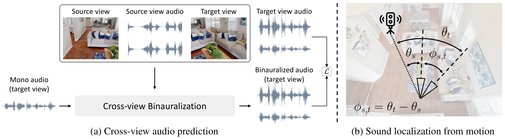

Sound Localization from Motion: Jointly Learning Sound Direction and Camera Rotation
==================================================================
<h4>
Ziyang Chen, Shengyi Qian, Andrew Owens
</br>
<span style="font-size: 14pt; color: #555555">
University of Michigan, Ann Arbor
</span>
</br>
ICCV 2023
</br>
</h4>
<hr>

This repository contains the official codebase for [Sound Localization from Motion: Jointly Learning Sound Direction and Camera Rotation](https://arxiv.org/abs/2303.11329). [[Project Page](https://ificl.github.io/SLfM/)]

<div align="center">
  
</div>


## Environment
To setup the environment, please simply run

```bash
conda env create -f environment.yml
conda activate SLfM
```


## Datasets

### LibriSpeech 
We use speech samples from this dataset to render binaural audio. Data can be downloaded from [here](https://www.openslr.org/12). Please see `Dataset/LibriSpeech` for more processing details.

### Free Music Archive (FMA)
We use audio samples from this dataset to render binaural audio. Data can be downloaded from [FMA offical github repo](https://github.com/mdeff/fma). Please see `Dataset/Free-Music-Archive` for more processing details.

### HM3D-SS
we use the [SoundSpaces 2.0 platform](https://github.com/facebookresearch/sound-spaces) and [Habitat-Matterport 3D dataset](https://aihabitat.org/datasets/hm3d/) to create our audio-visual dataset *HM3D-SS*. Please follow the installation guide from [here](https://github.com/facebookresearch/sound-spaces/blob/main/INSTALLATION.md). 

We provide the code under `(Dataset/AI-Habitat)` for generating the dataset. To create HM3D-SS dataset, simply run:

```bash
cd Dataset/AI-Habitat
# please check out the bash files before running, which require users to sepecify the output directory
sh ./multi-preprocess.sh
sh ./multi-postprocess.sh
```

### Demo Videos
We also provide self-recorded real-world videos under `Dataset/DemoVideos/RawVideos`. The videos are recorded using iPhone 14 Pro and binaural audio are recorded with [Sennheiser AMBEO Smart Headset](https://www.amazon.com/Sennheiser-AMBEO-Smart-Headset-iOS/dp/B0744PC5J8/ref=asc_df_B0744PC5J8/?tag=hyprod-20&linkCode=df0&hvadid=312026001792&hvpos=&hvnetw=g&hvrand=9381493589681000849&hvpone=&hvptwo=&hvqmt=&hvdev=c&hvdvcmdl=&hvlocint=&hvlocphy=1019126&hvtargid=pla-450898583753&psc=1&mcid=6a07d1c26fea3d9083a2935a607ea1b1&gclid=CjwKCAiA1fqrBhA1EiwAMU5m_w16nslwxzCBdzRxE-xgPVX7zCJKjCydEeSbH_TRRUnhHiAfVGNaQBoC-TIQAvD_BwE). **The demo videos are for research purposes only**. 


## Pretrained Models

We will release several models pre-trained with our proposed methods. We hope it could benefit our research communities. To download all the checkpoints, simply run

```bash
cd slfm
sh ./scripts/download_models.sh
```

## Train & Evaluation
We provide training and evaluation scripts under `scripts`, please check each bash file before running.

- To train and evaluate our SLfM cross-view binauralization pretext task and perform linear probing experiments, simply run: 
```bash
cd slfm
sh ./scripts/training/slfm-pretext.sh
```

- To train and evaluate our SLfM model with freezed embedding from the pretext task, simply run: 
```bash
cd slfm
sh ./scripts/training/slfm-geometric.sh
```


## Citation

If you find this code useful, please consider citing:

```text
@inproceedings{
    chen2023sound,
    title={Sound Localization from Motion: Jointly Learning Sound Direction and Camera Rotation},
    author={Chen, Ziyang and Qian, Shengyi and Owens, Andrew},
    booktitle = {ICCV},
    year={2023}
}
```

## Acknowledgment
This work was funded in part by DARPA Semafor and Sony. The views, opinions and/or findings expressed are those of the authors and should not be interpreted as representing the official views or policies of the Department of Defense or the U.S. Government.